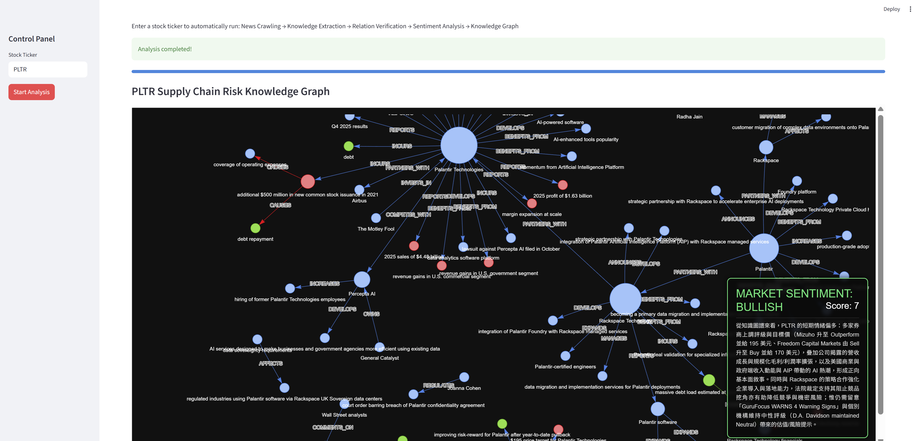

# AI Financial Supply Chain Risk Knowledge Graph  
# AI 金融供應鏈風險知識圖譜

> Turn financial news into a structured knowledge graph—automatically.  
> 把財經新聞自動轉成「可查可視覺化」的知識圖譜。  
>
> Crawl news → extract triples with LLM → verify & clean → sentiment summary → interactive HTML graph  
> 新聞爬取 → LLM 三元組抽取 → 自動驗證清洗 → 市場情緒摘要 → 互動式 HTML 圖譜

---

## Introduction / 專案簡介

This project is an end-to-end pipeline for building a **financial supply chain risk knowledge graph** from recent news.

你只要輸入一個美股代號（例如 `PLTR`, `TSLA`），系統就會自動完成以下流程：

- **抓最新相關新聞**（yfinance + 簡易爬蟲）
- 用 **LLM 抽取 (Entity, Relation, Entity) 三元組**
- 透過 **Auto Verifier** 做結構與關係的校正，降低雜訊與幻覺
- 產出 **市場情緒（Bullish / Bearish）**與摘要
- 生成 **互動式 HTML 知識圖譜**（含情緒浮水印）

---

## Key Features / 核心功能

- **Automated News Crawling / 自動新聞採集**  
  Pulls recent articles using `yfinance` + lightweight scraping.  
  整合 `yfinance` 與簡易爬蟲，抓取近期與股票相關的新聞內容。

- **LLM Knowledge Extraction (Zero-shot) / LLM 知識抽取（Zero-shot）**  
  Converts unstructured news text into structured triples for a knowledge graph.  
  將非結構化新聞文字轉成可用於知識圖譜的結構化三元組。

- **Auto Verification & Cleaning / 自動驗證與清洗**  
  Enforces a strict relation schema, fixes or deletes unreliable triples.  
  依照嚴格關係白名單進行校驗，修正不合規關係並移除疑似幻覺。

- **Market Sentiment Analysis / 市場情緒分析**  
  Produces a Bullish/Bearish signal and a short summary.  
  根據抽取後資訊產生多空訊號與投資摘要（偏解讀輔助）。

- **Interactive Visualization / 互動式視覺化**  
  Exports an interactive HTML network graph and injects a sentiment watermark.  
  匯出互動式 HTML 圖譜，並以 DOM 注入方式加上情緒浮水印。

- **Two Interfaces / 兩種操作介面**  
  Use it in **CLI** or in a **Streamlit Web App**.  
  同時提供命令列與網頁介面，方便 demo 與開發。

---

## Installation / 安裝與設定

### 1) Clone the repository / 下載專案
```bash
git clone https://github.com/your-username/your-repo-name.git
cd your-repo-name
```

### 2) Install dependencies / 安裝依賴套件
> Python 3.8+ recommended / 建議 Python 3.8+

```bash
pip install -r requirements.txt
```

### 3) Set environment variables / 設定環境變數
Create a `.env` file in the project root / 在專案根目錄建立 `.env`：

```text
OPENAI_API_KEY=sk-xxxxxxxxxxxxxxxxxxxxxxxxxxxxx
```

---

## Usage / 使用方式

### Streamlit Web App (recommended) / 網頁版
Run the app / 啟動：

```bash
streamlit run src/app.py
```

Open the browser page, enter a ticker (e.g., `PLTR`), and click **Start Analysis**.  
打開瀏覽器後輸入股票代號（如 `PLTR`），點 **Start Analysis** 即可。

Follow the prompt to input a ticker and the pipeline will run end-to-end.  
依照提示輸入代號，系統會跑完整流程並輸出檔案到 `output/`。

---

## ⚙️ Pipeline Architecture / 系統流程

| Step | Module | What it does | 說明 |
|---|---|---|---|
| 01 | Data Collection | Crawls the latest ticker-related news | 抓新聞與整理內容 |
| 02 | LLM Extraction | Extracts `(Entity, Relation, Entity)` triples | LLM 抽三元組（Zero-shot） |
| 03 | Auto Verifier | Enforces schema, fixes relations, removes noise | 自動驗證、修正與刪除不可靠結果 |
| 04 | Sentiment Analysis | Bullish/Bearish + short summary | 情緒判讀與摘要 |
| 05 | Visualization | Interactive HTML graph + watermark | 互動圖譜與浮水印 |

---

##  Demo / 成果展示



---

## License

MIT License. See [LICENSE](LICENSE).